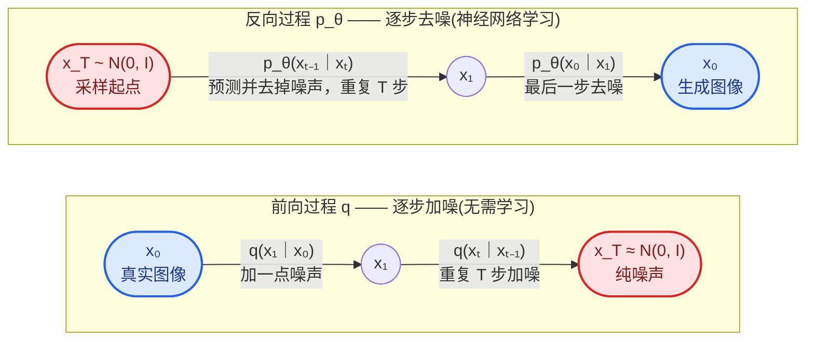
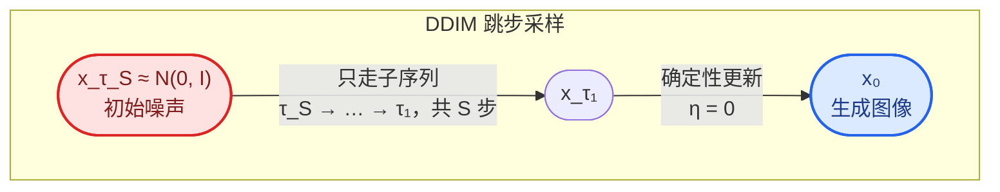

# DDPM (Denoising Diffusion Probabilistic Models)和DDIM

## DDPM的前向与反向过程
前向逐步加噪将数据变成纯噪声，反向学习将噪声变回数据

- 对于一张$256\times256\times3$的图片来说，如果将其展成一维，可以用一个`196608`维的向量表示，每一个维度都由`0~255`表示的话，那么这将是一个$256^{196608}$大小的空间。
对这个向量随机赋值，大部分情况都是毫无意义的纯噪声，只有某些特定的排列能够构成我们能够认知的图片。

- 因此加噪去噪从这个角度的理解的话，加噪就是把"可认知图片区域"里的一个点，一步步推向整个空间的噪声海洋，直到完全脱离图片流形、变成纯噪声；去噪（反向过程）就是反过来，从噪声海洋中的任意一点出发，一步步把它拉回图片区域。网络真正学到的，**是空间中每一点"往哪个方向挪一步才更靠近图片区域"的方向场——训练时见过无数条从图到噪声的路径，就能反推出从噪声回图的路径。**

- 生成一张新图，就是从纯噪声出发，沿网络指的方向走 $T$ 步，最终落到图片区域的某个点上；出发点的初始噪声 $x_T$ 不同，落点就不同，于是得到不同的新图。


## 前向过程
- 一个固定的马尔可夫链，每一步都给数据加点噪声
- 也可以直接一步到位，实现高效训练

按照每一步加噪的公式：
$$
q(x_t|x_{t-1})= \mathcal{N}(x_t;\sqrt{1-\beta_t}\,x_{t-1},\beta_t I)
$$
其中$\beta_t$是预设的噪声调度， q是加噪的分布。

- 论文的调度：$\beta_t$ 从 $10^{-4}$ 线性增大到 $0.02$，$T=1000$
- 当 $t\to T$ 时 $\bar{\alpha}_t\to 0$，所以 $x_T\approx\mathcal{N}(0,I)$——这是反向过程"从纯噪声出发"的依据

一步到位公式：
$$
x_t=\sqrt{\bar{\alpha}_t}\,x_0+\sqrt{1-\bar{\alpha}_t}\,\epsilon,\qquad \epsilon \sim \mathcal{N}(0,I)
$$

## 反向过程
- 本质：训练一个神经网络$\epsilon_\theta$来预测当前样本里混入了多少的噪声。
$$
\mu_\theta(x_t,t)=\frac{1}{\sqrt{\alpha_t}}\left(x_t-\frac{1-\alpha_t}{\sqrt{1-\bar{\alpha}_t}}\,\epsilon_{\theta}(x_t,t)\right)
$$

**关键引理（上面公式的来源）**：给定 $x_0$ 后，条件后验 $q(x_{t-1}|x_t,x_0)$ 有闭式高斯解：
$$
q(x_{t-1}|x_t,x_0)=\mathcal{N}\left(x_{t-1};\ \tilde{\mu}_t(x_t,x_0),\ \tilde{\beta}_t\mathbf{I}\right)
$$
其中
$$
\tilde{\mu}_t(x_t,x_0)=\frac{\sqrt{\bar{\alpha}_{t-1}}\,\beta_t}{1-\bar{\alpha}_t}x_0+\frac{\sqrt{\alpha_t}\,(1-\bar{\alpha}_{t-1})}{1-\bar{\alpha}_t}x_t,\qquad \tilde{\beta}_t=\frac{1-\bar{\alpha}_{t-1}}{1-\bar{\alpha}_t}\beta_t
$$
这就是反向过程要逼近的"老师信号"。再把一步到位公式反解出 $x_0=(x_t-\sqrt{1-\bar{\alpha}_t}\,\epsilon)/\sqrt{\bar{\alpha}_t}$ 代入 $\tilde{\mu}_t$，就得到上面用 $\epsilon_\theta$ 参数化的 $\mu_\theta$——网络只需预测噪声。

训练时，随机取时间步 $t$、一张真实图 $x_0$、一个高斯噪声 $\epsilon$，按一步到位公式构造出 $x_t$，让网络 $\epsilon_\theta$ 去预测混入的噪声 $\epsilon$，算 MSE。

训练目标从变分下界（ELBO）推导而来：最大化 $\log p_\theta(x_0)$ 的下界，展开为 $L_0+L_1+\cdots+L_T$，每一项 $L_t$ 都是让 $p_\theta(x_{t-1}|x_t)$ 逼近上面的"老师信号" $q(x_{t-1}|x_t,x_0)$；代入噪声参数化并化简后，每项就成了噪声预测的 MSE。训练损失：
$$
L=\mathbb{E}_{t,x_0,\epsilon}\left[\left\|\epsilon-\epsilon_\theta(x_t,t)\right\|^2\right]
$$
> 严格推导出的 ELBO 里本来还有个权重系数，论文发现直接丢掉它、只用上面这个简单形式效果反而更好。

**网络结构**：$\epsilon_\theta$ 是一个 U-Net；时间步 $t$ 用正弦位置编码转成向量，注入 U-Net 的各层。**所有时间步共享同一个网络**——这也是 DDPM 训练高效的关键。

## 训练与采样伪代码

**训练**
```
repeat
    x_0 ~ q(x_0)                          # 从数据集采样一张真实图
    t   ~ Uniform({1, ..., T})            # 随机取一个时间步
    ε   ~ N(0, I)                         # 采样一个高斯噪声
    x_t = √ᾱ_t·x_0 + √(1-ᾱ_t)·ε          # 一步到位构造加噪图
    梯度下降: L = ‖ε - ε_θ(x_t, t)‖²     # 让网络预测混入的噪声，算 MSE
until 收敛
```

**采样（生成）**
```
x_T ~ N(0, I)                             # 从纯噪声出发
for t = T, ..., 1:
    z ~ N(0, I)  若 t > 1，否则 z = 0
    x_{t-1} = (1/√α_t)·(x_t - (1-α_t)/√(1-ᾱ_t)·ε_θ(x_t, t)) + σ_t·z
return x_0                                # 一步步去噪，最终得到生成图像
```
其中 $\sigma_t=\sqrt{\beta_t}$（论文取固定值，不学习；也可取后验方差 $\tilde{\beta}_t$，两种选择效果接近）。

> 采样必须完整走 T 步，速度慢是 DDPM 的主要缺点；DDIM 用跳步采样大幅加速。

## DDIM (Denoising Diffusion Implicit Models)

**动机**：DDPM 采样必须一步步走完 T 步（通常 1000 步），太慢。DDIM 的思路：**训练目标完全不变**（可直接复用训练好的 DDPM 模型），只把采样从"马尔可夫随机过程"换成"非马尔可夫的确定性过程"，于是可以跳步采样，几十步就能生成。

**为什么训练可以不变**：DDIM 构造的非马尔可夫前向过程保持边缘分布 $q(x_t|x_0)=\mathcal{N}\left(\sqrt{\bar{\alpha}_t}\,x_0,\,(1-\bar{\alpha}_t)\mathbf{I}\right)$ 不变，而 DDPM 的训练目标只依赖这些边缘分布，所以同一个模型可以直接复用、无需重训。



**采样公式**：先由网络预测"去噪后的原图"
$$
\hat{x}_0 = \frac{x_t-\sqrt{1-\bar{\alpha}_t}\,\epsilon_\theta(x_t,t)}{\sqrt{\bar{\alpha}_t}}
$$
再更新一步：
$$
x_{t-1} = \sqrt{\bar{\alpha}_{t-1}}\,\hat{x}_0 + \sqrt{1-\bar{\alpha}_{t-1}-\sigma_t^2}\,\epsilon_\theta(x_t,t) + \sigma_t z,\qquad z\sim\mathcal{N}(0,I)
$$
其中 $\sigma_t$ 由超参数 $\eta\in[0,1]$ 控制：
$$
\sigma_t = \eta\sqrt{\frac{1-\bar{\alpha}_{t-1}}{1-\bar{\alpha}_t}}\sqrt{1-\frac{\bar{\alpha}_t}{\bar{\alpha}_{t-1}}}
$$

- $\eta=0$：完全确定性采样，给定同一个初始噪声，生成结果唯一——"Implicit" 的由来
- $\eta=1$：恰好退化为 DDPM 的采样方式

**跳步采样（加速的关键）**：不必走遍 $1,\dots,T$，只需取一个子序列 $\{\tau_1,\dots,\tau_S\}$（如等间隔取 50 个），按这些时间步采样即可。步数从 1000 降到 50，速度提升约 20 倍，质量几乎不降。

**为什么能跳步**：

- **DDPM 不能跳**：每步都要注入按"相邻两步间距"标定好的随机噪声 $\sigma_t z$，跳步会让噪声量对不上——随机过程的路径不能随便跳
- **DDIM 的更新公式不依赖"上一步"**：$x_{t-1}$ 只由 $x_t$、$\epsilon_\theta(x_t,t)$ 和系数 $\sqrt{\bar{\alpha}}$ 决定，跨度由系数天然决定——把 $t-1$ 换成 $t-20$，公式照样成立
- **时间步 $t$ 仍然喂给网络**：$\bar{\alpha}_t$ 编码了"当前还剩多少信号"，网络看到 $t$ 就知道噪声水平，预测依然准确——跳的是路，不是信息
- **深层原因**：$\eta=0$ 时整个过程是在解概率流 ODE（欧拉离散），ODE 的步长本来就自由——跳步采样 = 用大步长解同一个 ODE

**代价**：步数越少，每步跨度越大、离散误差越大。50 步质量几乎无感，10 步左右开始掉，1 步则退化成普通回归——步数是速度与质量之间的权衡旋钮。

**伪代码**
```
x_T ~ N(0, I)                                  # 初始纯噪声
for i = S, ..., 1:                             # S << T，按子序列跳步
    t = τ_i
    ε̂ = ε_θ(x_t, t)                            # 预测噪声
    x̂_0 = (x_t - √(1-ᾱ_t)·ε̂) / √ᾱ_t           # 由噪声反推"原图"
    x_{t-1} = √ᾱ_{t-1}·x̂_0 + √(1-ᾱ_{t-1}-σ_t²)·ε̂ + σ_t·z   # η=0 时 σ_t=0，z 项消失
return x_0
```

**与 ODE 的联系**：$\eta=0$ 时，这个过程可看作对某个概率流 ODE 的欧拉离散，步长可以灵活选择；这也是后来 consistency model 等更激进加速方法的起点。

## DDPM vs DDIM 总结

一句话：**训练一模一样，不一样的只有采样算法**。DDIM 不是新模型，是同一模型的一套新采样方式。

| 维度 | DDPM | DDIM |
|---|---|---|
| 前向过程 | 马尔可夫链，每步只依赖上一步 | 非马尔可夫，但边缘分布 $q(x_t\|x_0)$ 保持不变 |
| 训练目标 | $\mathbb{E}\left\|\epsilon-\epsilon_\theta(x_t,t)\right\|^2$ | 完全相同，可直接复用训练好的模型 |
| 采样随机性 | 随机，每步注入新噪声 $z$ | 可调：$\eta=0$ 完全确定 |
| 采样步数 | 必须走满 $T$（1000）步 | 可跳步，几十步 |
| 同一个 $x_T$ 采样两次 | 结果不同 | $\eta=0$ 时结果唯一 |
| 速度 | 慢 | 快约 20 倍，质量几乎不降 |

- **精确关系**：DDIM 是更一般的采样框架，DDPM 是它在 $\eta=1$ 且不跳步时的特例
- **为什么能共用模型**：训练目标只依赖边缘分布 $q(x_t|x_0)$，DDIM 构造非马尔可夫前向时刻意保持边缘分布不变——改的只是训练时用不到的部分（前向的路径结构）
- **副产品**：$\eta=0$ 时图像是 $x_T$ 的确定性函数，可以在两个初始噪声之间插值（slerp），得到语义连续过渡的图像序列
