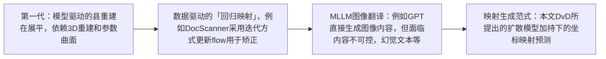
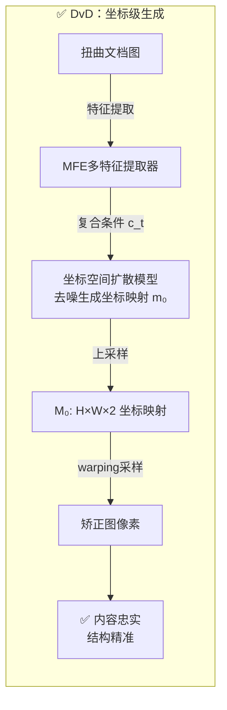
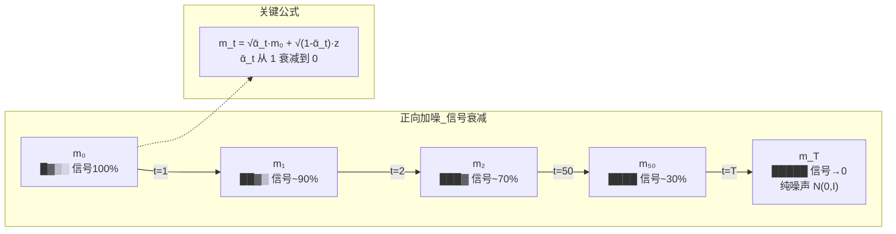

# DvD论文理解

## 核心贡献：扩散模型+迭代思想！！！
1. 范式创新：不同于在像素空间中直接生成较真图形的典型做法，在坐标空间进行去噪来生成用于矫正的坐标映射。
2. 时变条件精炼机制：引入了一种时变条件精炼机制，动态将中间矫正结果作为引导，增强文档的结构保证性。

## 方法演变过程
文档矫正经历了几个阶段的演变过程：

## 基本框架
DvD 不直接生成矫正后的图像像素，而是用扩散模型生成坐标映射（Mapping）。拿到映射后，通过简单的空间变换（warping）就能得到矫正图。

论文原图：

模型框架 对应论文Fig 2

给定一张扭曲文档作为输入，DvD 生成隐变量 m 来刻画用于形变矫正的映射。我们利用一个复合条件 $c_t$：分别为原始文档图像的特征 $f_d$、文档前景掩码 $f_m$、文本行 $f_l$，以及中间结果的时变条件 $r_t$。右侧粉色区域展示了逆向去噪生成过程。

## 要点理解
### 坐标映射怎么做？
- 核心思路是：不直接生成图的像素，而是生成一个坐标映射表（两通道），告诉矫正图像上每个位置应该从扭曲图的哪个坐标进行采样。
Step 1：DvD在$64\times 64$分辨率下生一个缩放版本的映射$m_0$，节省计算开销。每个格子存两个数（u坐标和v坐标）。
Step 2：上采样到原图分辨率。对于矫正图上的每个像素(u,v)，$M'(u,v)=(i,j)$表示需要从原图的$(i,j)$采样。
Step 3：双线性采样，得到最终图像。

DvD 矫正示意图 对应论文Fig 3

### Doc3D数据集介绍
### $M_0$是什么？从何而来？
- 训练阶段：来自Doc3D数据集的GT，形变量是软件生成的，每个弯曲像素（i,j）和对应的平坦位置（u，v）是已知晓的，所以可以直接算出来真是的反向映射$M_0$作为训练标签。
- 推理阶段：推理时没有GT，因此模型是从纯噪声$m_T$开始在复合条件$c_t$引导下逐步去噪恢复出$m_0$上采样得到$M_0$。
### 复合条件 $c_t$ 是什么？
- 由多特征提取器来增强文档视觉感知
- 记为$c_t={f_d,f_m,f_l,r_t}$，其中$f_d$是原始文档图像的特征，$f_m$是文档前景掩码，$f_l$是文本行，$r_t$是中间结果的时变条件。
- $f_d, f_m, f_l$均为时不变条件，$r_t$是时变条件，用于引导模型学习中间结果的矫正。
### `diffusion process`是什么？去噪又是怎么做？
- 加噪公式：【论文公式2】
$$
m_t=\sqrt{\bar{\alpha}_t}m_0+\sqrt{1-\bar{\alpha}_t}z, z~\sim N(0,I)
$$
其中，$z$是一个标准正态分布的噪声，$\bar{\alpha}_t=\Pi_{i=1}^{t}(1-\beta_{i})$，$\beta_{t}$是预先定义好的方差调度参数。
他是一个不需要学习的东西，是一个纯粹的高斯转移过程，框架如下：

- 去噪公式：【论文公式3】
$$
m_{t-1}=\sqrt{\hat{\alpha}_{t-1}}\epsilon_{\theta}(m_t,t,c_t)+\frac{\sqrt{1-\hat{\alpha}_{t-1}-\sigma^2}}{\sqrt{1-\hat{\alpha}}}(m_t-\sqrt{\hat{\alpha}_t}\epsilon_{\theta}(m_t,t,c_t))+\sigma_tz
$$
其中$\epsilon_{\theta}(m_t,t,c_t)$直接预测出纯噪声分布图$\hat{m}_{0,t}$。

- 去噪过程与Stable Diffusion过程完全相同。

### 时变条件如何引导模型学习？
- 时变条件中只有$r_t$，其他条件都是静态的。
- $r_t$ 中的 $m_{0|t}$ 没有独立的监督信号，只是作为一种额外的喂给模型的信息。
- 仅有最终输出的 $m_0$ 参与loss计算。
- 梯度反向穿过交叉注意力层，到达处理 $r_t$ 的网络参数后，模型发现某个特定形态的 $m_{0|t}$ 总是伴随着某种参与误差，于是模型学会了看到这种中间状态就知道该往哪个方向纠正。
- $f_{0|t}$ 是 $f_0$ 利用 $m_{0|t}$ 映射得到文档特征。
### 为什么叫反向映射？
反向映射是为了填补矫正图上的空缺而去原图中采样，没有空洞；而正向映射则是从扭曲图中每个像素推到矫正图，可能引入空洞。

### 训练过程怎么做的？

