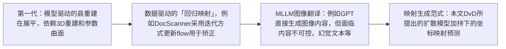
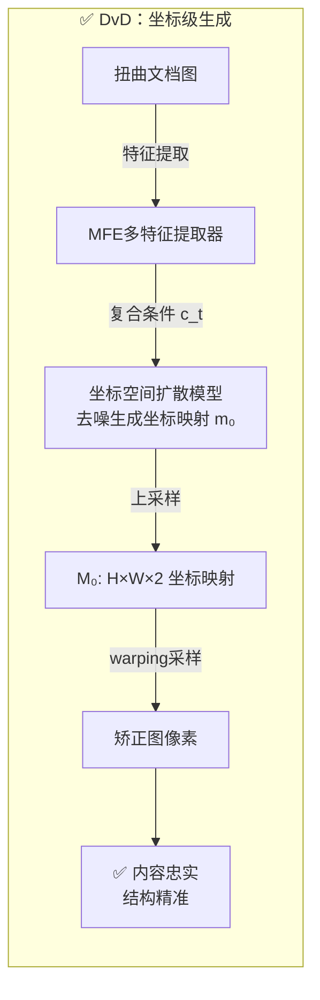
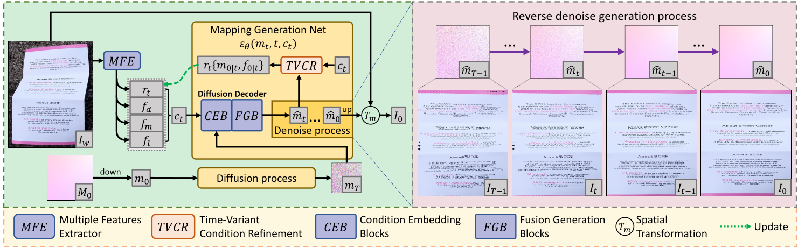
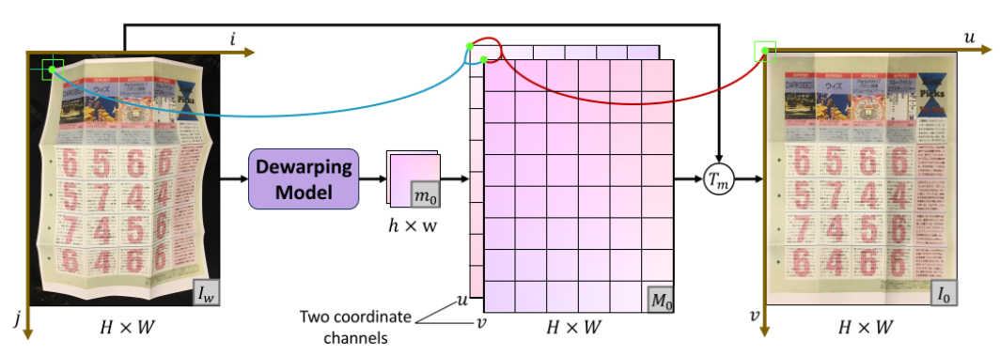
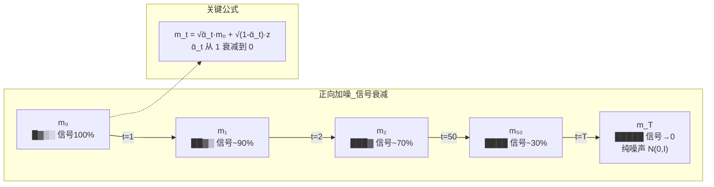
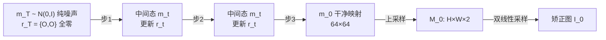

# DvD论文理解

## 核心贡献：扩散模型+迭代思想！！！
1. 范式创新：不同于在像素空间中直接生成较真图形的典型做法，在坐标空间进行去噪来生成用于矫正的坐标映射。
2. 时变条件精炼机制：引入了一种时变条件精炼机制，动态将中间矫正结果作为引导，增强文档的结构保证性。


## 方法演变过程
文档矫正经历了几个阶段的演变过程：
<div align="center">



</div>

## 基本框架
DvD 不直接生成矫正后的图像像素，而是用扩散模型生成坐标映射（Mapping）。拿到映射后，通过简单的空间变换（warping）就能得到矫正图。
<div align="center">



</div>

论文原图：
<div align="center">


模型框架 对应论文Fig 2

</div>
给定一张扭曲文档作为输入，DvD 生成隐变量 m 来刻画用于形变矫正的映射。我们利用一个复合条件 $c_t$：分别为原始文档图像的特征 $f_d$、文档前景掩码 $f_m$、文本行 $f_l$，以及中间结果的时变条件 $r_t$。右侧粉色区域展示了逆向去噪生成过程。

## 要点理解
### 坐标映射怎么做？
- 核心思路是：不直接生成图的像素，而是生成一个坐标映射表（两通道），告诉矫正图像上每个位置应该从扭曲图的哪个坐标进行采样。
Step 1：DvD在$64\times 64$分辨率下生一个缩放版本的映射$m_0$，节省计算开销。每个格子存两个数（u坐标和v坐标）。
Step 2：上采样到原图分辨率。对于矫正图上的每个像素(u,v)，$M'(u,v)=(i,j)$表示需要从原图的$(i,j)$采样。
Step 3：双线性采样，得到最终图像。

<div align="center">


DvD 矫正示意图 对应论文Fig 3
</div>

### Doc3D数据集介绍
### $M_0$是什么？从何而来？
- 训练阶段：来自Doc3D数据集的GT，形变量是软件生成的，每个弯曲像素（i,j）和对应的平坦位置（u，v）是已知晓的，所以可以直接算出来真是的反向映射$M_0$作为训练标签。
- 推理阶段：推理时没有GT，因此模型是从纯噪声$m_T$开始在复合条件$c_t$引导下逐步去噪恢复出$m_0$上采样得到$M_0$。
### 复合条件 $c_t$ 是什么？
- 由多特征提取器来增强文档视觉感知
- 记为$c_t={f_d,f_m,f_l,r_t}$，其中$f_d$是原始文档图像的特征，$f_m$是文档前景掩码，$f_l$是文本行，$r_t$是中间结果的时变条件。
- $f_d, f_m, f_l$均为时不变条件，$r_t$是时变条件，用于引导模型学习中间结果的矫正。
### `diffusion process`是什么？去噪又是怎么做？
- 加噪公式：【论文公式2】
$$
m_t=\sqrt{\bar{\alpha}_t}m_0+\sqrt{1-\bar{\alpha}_t}z, z~\sim N(0,I)
$$
其中，$z$是一个标准正态分布的噪声，$\bar{\alpha}_t=\Pi_{i=1}^{t}(1-\beta_{i})$，$\beta_{t}$是预先定义好的方差调度参数。
他是一个不需要学习的东西，是一个纯粹的高斯转移过程，框架如下：


- 去噪公式：【论文公式3】
$$
m_{t-1}=\sqrt{\hat{\alpha}_{t-1}}\epsilon_{\theta}(m_t,t,c_t)+\frac{\sqrt{1-\hat{\alpha}_{t-1}-\sigma^2}}{\sqrt{1-\hat{\alpha}}}(m_t-\sqrt{\hat{\alpha}_t}\epsilon_{\theta}(m_t,t,c_t))+\sigma_tz
$$
其中 $\epsilon_{\theta}(m_t,t,c_t)$ 直接预测去噪后的**干净映射** $\hat{m}_{0,t}$（x0-prediction：预测目标本身而非噪声，与 DDPM/SD 相反）。

- 去噪过程与Stable Diffusion过程完全相同。

### 时变条件如何引导模型学习？
1. $r_t$里面装了两个东西
    - $m_{0|t}$:第 $t$ 步时模型预测出的"干净映射"(在 64×64 坐标空间上)
    - $f_{0|t}$:把文档特征 $f_d$ 用 $m_{0|t}$ 做一次 warp(即公式 1 的双线性采样)得到的"中间矫正后的文档特征图"

$f_{0|t}$ 把"我目前的映射把文档矫正成什么样了"变成了一个可见的特征图。模型不是凭空猜自己错在哪,而是直接"看到"自己当前产出作用在文档上的效果。

2. 他是怎么进入去噪网络的？
- 论文3.3、图4提到，四个条件（$r_t,f_d,f_m,f_l$）进入四个分别平行独立的CEB模块分支，每个分支都是DiT式的交叉注意力
- 每个分支而言：$m_t$加时间嵌入后作为query，条件（$r_t,f_d,f_m,f_l$）作为K/V
- 四个分支输出拼起来进入FGB模块融合，最后投影输出$\hat m_0$
- "指导"在机制上就是:去噪的每一步,$m_t$ 都通过注意力从 $r_t$ 里检索信息——注意力权重决定当前去噪状态要"看"中间结果的哪部分,比如哪些文字区域还歪着、哪些边缘还没对齐。

3. $r_t$怎么被算出来
- 训练时：先自滚采样（rollout）从纯噪声 $m_T$ 一路 DDIM 走到 $t$，每步用当前模型的预测更新时变条件（详见下方【训练过程】的 Algorithm 1 解读）
- 推理时：天然自洽——每步的预测 $\hat m_{0,t}$ 顺手 warp 出 $f_{0|t}$，喂给下一步，无额外开销

### 为什么叫反向映射？
反向映射是为了填补矫正图上的空缺而去原图中采样，没有空洞；而正向映射则是从扭曲图中每个像素推到矫正图，可能引入空洞。
- 坐标映射与采样公式 【原论文公式1】
$$
(i,j)=M_0(u,v),
I_0(u,v)=T_m(I_w(i,j))
$$
其中$M_0$是后向映射，$I_w$是输入的有扭曲图像，$I_0$要输出的展平的文档图像，$(u,v)$展平图$I_0$上的像素坐标，$(i,j)$是扭曲图像$I_w$上的像素坐标。$T_m$用于从扭曲图像中采样。

1. 查表：给定展平图上的位置 (u,v) ，去映射 M₀ 里查，得到它对应原图上的坐标 (i,j) 。
2. 采样： 1. 拿着 (i,j) 去扭曲图 I_w 里采样像素值，赋给 I₀(u,v) 。
对展平图上的 每个像素 都做一遍，就得到了完整的展平结果 I₀ 。

### 训练过程怎么做的？

#### 数据与标签
- 训练集只用 Doc3D（合成数据）：弯曲形变由软件生成，每个弯曲像素 (i,j) 与平坦位置 (u,v) 的对应关系已知，可直接算出 GT 反向映射 $m_0$（降采样到 64×64）作为监督标签。

#### 条件准备
- $f_d$：VGG16 前 3 个 block 提取，与扩散解码器**联合训练**
- $f_m$（U2Net 前景分割）、$f_l$（UNet 文本行）：权重**冻结**，沿用 DocGeoNet 的预训练参数
- 所有特征统一降采样到 64×64，与坐标空间对齐

#### TVCR 带来的特殊性：先采样、后训练
vanilla 扩散训练只需：随机抽 $t$ → 前向加噪得到 $m_t$ → 算 loss。但 DvD 的时变条件 $r_t$ 无法由 GT 直接给出，必须来自**模型自己的生成轨迹**，所以每个 iteration 要先做一次自滚采样（rollout）来制造 $r_t$，即论文 Algorithm 1：

| 步骤 | 操作 | 解读 |
|---|---|---|
| 1 | $m_0\sim q(m_0\mid c_t)$，$t\sim$ Uniform$(\{1,...,T\})$ | 取训练样本的 GT 映射；随机抽时间步 |
| 2-3 | 若 $t=T$：$r_T=\{O,O\}$ | 纯噪声起点没有中间结果，时变条件置全零 |
| 4-8 | 若 $t<T$：for $k=T-1\to t$ | **rollout**：从 $m_T\sim N(0,I)$ 出发按公式3逐步 DDIM 采样直到 $t$；每步用当前模型预测 $\hat m_{0,k}$，warp 出 $f_{0|k}$，更新时变条件 |
| 9-11 | $r_t=\{m_{0|t},f_{0|t}\}$，$c_t=\{f_d,f_m,f_l,r_t\}$ | 取 rollout 走到 $t$ 时的结果，组装完整条件 |
| 12 | 按公式5优化 | 前向加噪的 $m_t$ + 完整 $c_t$ → 算 L2 loss → 反向传播。**真正的优化只有这一行** |

关键点：
- rollout 循环内**没有梯度回传**，是纯前向的「模拟推理轨迹」（论文未明说 detach，实践上必须如此，否则梯度要穿过 $T-t$ 层展开的网络）
- **为什么必须 rollout**：若训练时喂的是「GT 映射 warp 出的完美特征」，推理时模型看到的却是自己不完美的中间预测，训练/推理分布失配。rollout 让训练条件来自模型自己的轨迹，类似 RNN 里的 scheduled sampling 思想
- **代价**：每个 iteration 额外 $T-t$ 次网络前向 → 论文 Limitations 中「训练慢」的来源

#### 损失函数
$$
\mathcal{L}=\mathbb{E}_{m_0,z,t}\left[\|m_0-\epsilon_\theta(m_t,t,c_t)\|^2\right]
$$
- 采用 **x0-prediction**：网络直接预测干净映射本身，而非预测噪声（与 DDPM/SD 相反，仿照 FlowDiffuser/DiffMatch）
- 只有最终输出的 $m_0$ 参与 loss；$m_{0|t}$、$f_{0|t}$ 没有独立监督，只作为额外条件输入

### 推理过程怎么做的？

推理就是训练 rollout 的「完整版」：从纯噪声一路走到干净映射，每一步都带着时变条件的更新。

<div align="center">



</div>

每步内部流程：
1. **前向**：$\epsilon_\theta(m_t,t,c_t)$ 预测干净映射 $\hat m_{0,t}$
2. **DDIM 更新**（公式3）：由 $m_t$ 和 $\hat m_{0,t}$ 算出 $m_{t-1}$
3. **warp**（公式1）：用 $\hat m_{0,t}$ 采样 $f_d$，得到中间矫正特征 $f_{0|t}$
4. **更新条件**：$r_{t-1}=\{m_{0|t},f_{0|t}\}$ 拼进 $c_{t-1}$，进入下一步

两个工程细节：
- **实际只用 3 步**：消融显示 1 步精度不足；3 步最优（0.59s/张）；50 步反而变差——步数过多累积误差，使样本偏离真实分布
- **双假设策略**：公式3中 DDIM 的 $\sigma_t$ 注入随机性，因此同时采样两条轨迹、取两个映射的平均作为最终结果，增强稳定性
- 最后将 $m_0$ 直接上采样到原图分辨率得到 $M_0$，双线性采样即可获得矫正图 $I_0$


## 代码要点速记

### 推理脚本

推理所需所有脚本：
```bash
data/DvD/
├── run_sampling.py                       # 入口：解析参数、动态加载 val_TDiff
├── admin/
│   ├── settings.py                       # Settings 类（L8）
│   ├── environment.py                    # env_settings() 加载 local（L64）
│   └── local.py                          # EnvironmentSettings：所有路径/超参（L1）
├── train_settings/dvd/
│   ├── val_TDiff.py                      # run()：装载模型 + 分发到评估（L40）
│   ├── evaluation.py                     # 逐图推理主循环（L142）
│   ├── eval_utils.py                     # extract_raw_features（train_VGG=False 时才用）
│   ├── feature_backbones/VGG_features.py # VGGPyramid：提图像特征（L15）
│   └── improved_diffusion/
│       ├── dist_util.py                  # 分布式初始化 / 加载权重（L20/44）
│       ├── script_util.py                # create_model_and_diffusion（L38）
│       ├── gaussian_diffusion.py         # DDIM 采样循环（L446/495/538）
│       ├── respace.py                    # SpacedDiffusion / space_timesteps（L63）
│       ├── cross_model.py                # DiT 主模型（L361）+ DiTBlock（L147）
│       ├── cross_attn.py                 # Decoder（DiT 最后解码头）
│       └── transformer.py                # （DDIMWithTransformer 用，本流程不用）
├── train_settings/models/geotr/
│   ├── geotr_core.py                     # U2NETP/GeoTr/Seg/GeoTr_Seg_Inf（L846起）
│   └── unet_model.py                     # UNet：文本行检测（L4）
├── datasets/
│   ├── __init__.py                       # 导出 Doc_benchmark（L5）
│   └── doc_dataset/doc_benchmark.py      # Doc_benchmark 数据加载（L49）
├── utils_data/image_transforms.py        # ArrayToTensor
└── utils_flow/
    ├── visualization_utils.py            # visualize_dewarping 保存结果（L64）
    └── ../datasets/utils/warping.py      # register_model2 = grid_sample（L73）

```

调用链：
```bash
run_sampling.py:62 expr_func(settings)
  └─ val_TDiff.py:40 run()
       ├─ script_util.py:38 create_model_and_diffusion
       │    ├─ script_util.py:93 create_model → cross_model.py:361 DiT
       │    └─ script_util.py:206 create_gaussian_diffusion → respace.py:63 SpacedDiffusion(3步)
       └─ val_TDiff.py:107 run_evaluation_docunet
            └─ evaluation.py:142 逐图循环
                 ├─ geotr_core.py:1003 GeoTr_Seg_Inf → mask_x
                 ├─ geotr_core.py:989  Seg → seg_map_all
                 ├─ unet_model.py:26    UNet → textline_map
                 ├─ evaluation.py:80 run_sample_lr_dewarping
                 │    └─ gaussian_diffusion.py:495 ddim_sample_loop
                 │         └─ gaussian_diffusion.py:446 ddim_sample
                 │              └─ gaussian_diffusion.py:328 model(x,t,...)
                 │                   └─ cross_model.py:568 DiT.forward ×3步
                 └─ visualization_utils.py:64 visualize_dewarping
                      └─ warping.py:73 grid_sample → 去畸变图

```

### 训练脚本：
```bash
run_training.py (入口)
  └─ train_TDiff.py::run(settings)
       ├─ create_model_and_diffusion()      → DiT-S/2 主模型 + 3 步 DDIM 扩散
       ├─ create_named_schedule_sampler()   → 时间步采样器
       ├─ UNet / Seg                        → 两个辅助网络（文本行 + 文档分割）
       ├─ Doc3d_Dataset + Loader            → 训练数据
       └─ TrainLoop(...).run_loop_dewarping()  ← 训练主循环
            └─ run_step()
                 └─ forward_backward_iteration()   (iter=True)
                      └─ diffusion.training_losses_time_variant()
                           └─ ddim_sample_loop_for_training()  ← 迭代回填 init_flow/init_feat

```
### 关键发现：
由于local.py里 iter=True，训练走的是 training_losses_time_variant（不是 training_losses_new_dit）：

损失函数内部会对每个非最后时间步单独跑一次 ddim_sample_loop_for_training（gaussian_diffusion.py:938），把预测的坐标场/特征回填进 init_flow/init_feat，这就是 time_variant 的迭代机制；

而推理时（val_TDiff.py）是直接 ddim_sample_loop 一次采样到底，两者在采样内部逻辑上共享同一套 DiT 前向。


