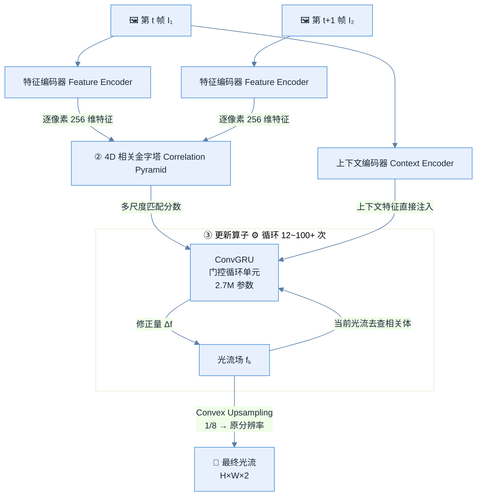
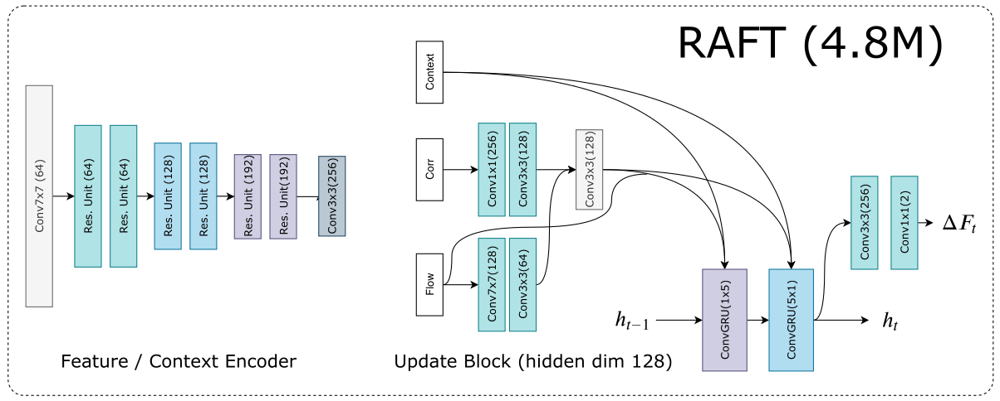
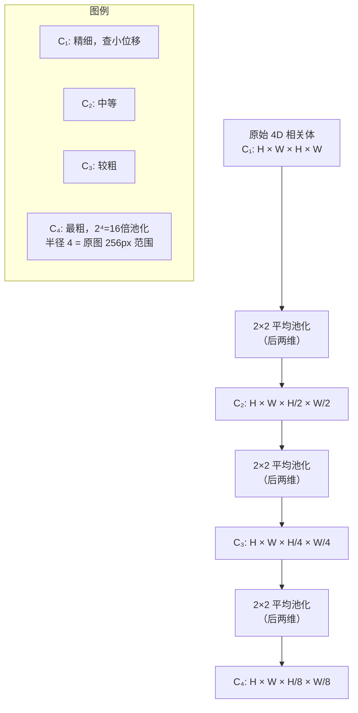
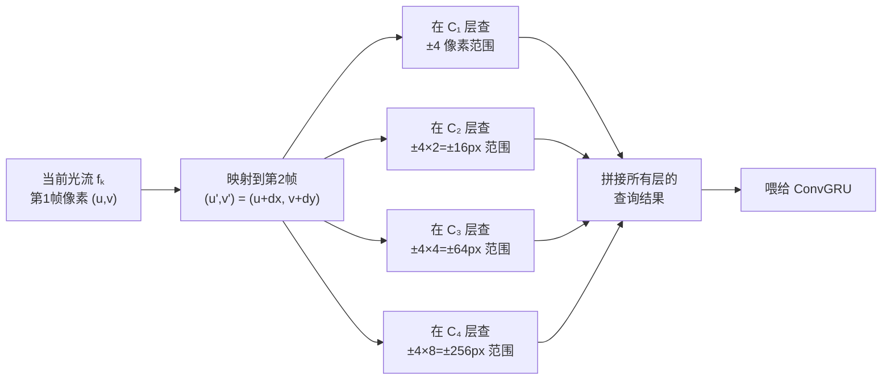
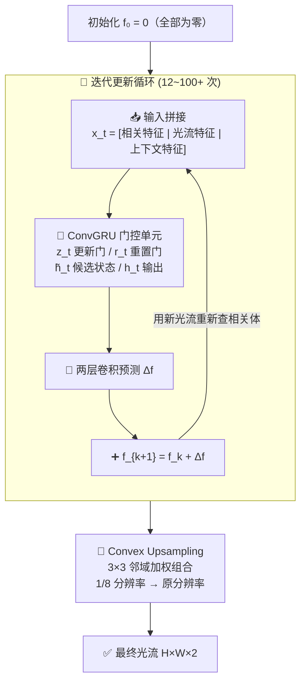

# RAFT 论文理解以及DocScanner 论文对比学习
[DocScanner 论文](./DocScanner.pdf)
[RAFT 论文](./RAFT.pdf)

## RAFT

### 基本点理解
#### 这个网络用来干啥？
给两帧画面，RAFT算出每个像素从第一帧挪到第二帧时，向哪个方向，移动了多少。

#### 输入输出？
输入：两帧画面
输出：一张光流图，包含每个像素的移动方向和移动距离

#### 基本流程：
1. 提取特征
2. 算所有像素对的相似度
3. 反复查相似度表来修正光流，越修越准

#### 什么是光流？
简单来说就是画面里每个像素的运动速度和方向。

#### 论文的基本框架：
RAFT 网络包含三个主要组件：
1. 特征提取器：从两张输入图像中提取逐像素的特征，以及一个上下文编码器，仅从第一帧图像中提取。
2. 相关层：对所有特征向量对计算内积，构建一个$W\times H\times W\times H$的相关体。最后两位经过多尺度优化，生成一组多尺度相关体。3
3. 一个基于GRU光流更新算子：从相关体中检索取值，并对初始为零的光流场进行迭代更新。

#### 什么是相关体?
- 他是一张巨大的相似度对照表——记录了第一帧每个像素和第二帧图像中每个像素的长的有多像。
- 经过特征提取后，每个像素拥有一个长度为$D=256$的向量。
- 第一帧中每个像素和第二帧中的每个像素都做向量内积，得到一个标量，如此一来第一帧中每个像素位置上的就会获得一个$H\times W$形状的张量，而一张图像拥有$W\times H$个像素，所以相关体的形状就是$W\times H\times W\times H$。

#### 多尺度池化是何意为？相关金字塔是？
- 论文中提到在最后两个维度做不同隔离度的平均池化，是为了直接查4D体，上下文感受范围有限的问题。
- 池化方式：

| 尺寸 | 形状 | 意义 |
|:---:|:---:|:---:|
|原始|$H\times W\times H\times W$|精细结构，适合小位移|
|1/2|$H\times W\times \frac{H}{2}\times \frac{W}{2}$|稍微粗糙|
|1/4|$H\times W\times \frac{H}{4}\times \frac{W}{4}$|更加粗糙|
|1/8|$H\times W\times \frac{H}{8}\times \frac{W}{8}$|最粗糙，但能够覆盖256像素的大位移|

那进一步怎么查呢？
更新算子每次迭代时，会用当前的光流估计在每一层金字塔的对应位置上查一个 半径 r 的小窗口（r=4 即 9×9=81 个特征值），然后把四层的查询结果拼接起来喂给 GRU。

#### 算子更新怎么做？

## DocScanner 与本论文的异同对比学习
DocScanner中的核心点是`warping flow`矫正流，与RAFT在结构上高度类似：
1. 权重绑定
2. ConvGRU更新单元
3. flow机制
4. 可学习的上采样模块

存在一下几点核心差异：

|差异维度|RAFT|DocScanner|
|:---:|:---:|:---:|
|匹配维度|4D全配对相关特征金字塔|warping操作|

- RAFT：构建了一个所有像素对相似度的大表，查询第一张图像中每个像素和第二帧图像中每个像素相似度。
- DocScanner：没有建相关体，而是直接用当前 warping flow 把扭曲图的特征 "掰直" 到矫正域，然后 GRU 看掰直后的特征哪里还不直、接着修 → 不需要全配对，因为文档矫正的映射关系没有光流那么复杂（不需要解决遮挡、快速运动等）。

