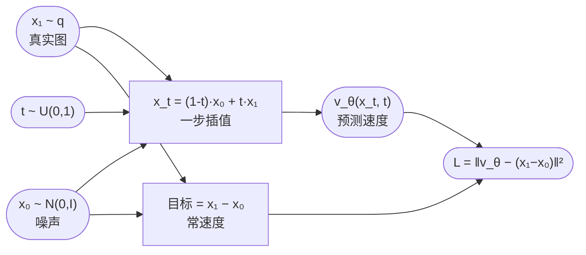
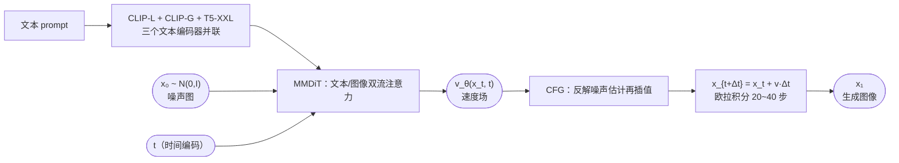

# Flow Matching

## 从概率流 ODE 出发

DDIM $\eta=0$ 的采样等价于解一条概率流 ODE，但那条 ODE 的速度场是"隐式"的——只有离散更新公式，没有显式的速度场。Flow Matching 回答的问题：**能不能直接把速度场学出来？** 答案：能，而且训练目标简单到和 DDPM 的 MSE 一个级别。

## 输运视角：生成 = 分布的"搬家"

- 源分布：纯噪声 $\mathcal{N}(0,I)$
- 目标分布：数据分布 $q$
- 速度场 $v(x_t,t)$ 定义一条 ODE：

$$
\frac{dx_t}{dt}=v(x_t,t),\qquad t\in[0,1]
$$

- 空间中每个点像一个小水滴，$v$ 是水流的方向和流速；噪声分布这片"云"沿水流漂 1 秒，漂完正好变成数据分布（pushforward）
- 生成 = 从噪声采一个点，沿 ODE 走 1 秒，落点就是一张图


## 核心难题

给定起止两个分布，能完成输运的速度场有**无穷多个**——不知道粒子该走哪条路。传统连续归一化流（CNF）用最大似然训练，每次算似然都要解 ODE，太贵。

## 关键技巧：条件流匹配（Conditional Flow Matching）

和 DDPM 的"一步到位公式"异曲同工：**先别管边缘分布，给每个具体数据点配一条简单的路**。

- 对每个真实数据 $x_1$，从一个噪声 $x_0$ 出发，走**直线插值路径**：

$$
x_t=(1-t)\,x_0+t\,x_1
$$

- $t$ 的双重身份：在公式里它就是个**权重**（混合系数）——$t=0$ 时 $x_t=x_0$ 纯噪声，$t=1$ 时 $x_t=x_1$ 数据，$t=0.5$ 是两者中点；但同时它也是 ODE 的**时间坐标**：粒子在时刻 $t$ 恰好走到 $x_t$，$v(x_t,t)$ 里的 $t$ 就是这个意思。两个身份自洽——$x_t$ 对 $t$ 求导 $=x_1-x_0$，正好是下一条的常速度
- 这条直线的速度场是**常数**：$v=x_1-x_0$（终点减起点）
- 构造 $x_t$ **一步完成**，和 DDPM 的"一步到位公式"同一个套路：DDPM 用 $x_t=\sqrt{\bar\alpha_t}x_0+\sqrt{1-\bar\alpha_t}\epsilon$ 一次跳到任意时刻（无需逐步加噪）；FM 用 $x_t=(1-t)x_0+tx_1$ 一次插值出中间态（无需先解 ODE）。**区别**：DDPM 的公式是从迭代加噪链**推导出来的性质**；FM 的公式是**人为设计的路径**——FM 里根本没有"加噪过程"，插值就是定义，不需要推导

**关键定理**：把所有条件速度场按数据分布求期望，得到的"平均速度场"恰好产生正确的边缘分布演化——网络学的是"一堆直线的平均方向"，而这个平均方向正好把噪声分布正确推成数据分布。


## 训练目标与伪代码

$$
L=\mathbb{E}_{t\sim U(0,1),\,x_1\sim q,\,x_0\sim\mathcal{N}(0,I)}\left[\left\|v_\theta(x_t,t)-(x_1-x_0)\right\|^2\right]
$$

### 损失逐项拆解

- $x_1\sim q$：从数据集随机取一张图，只提供"终点"
- $x_0\sim\mathcal{N}(0,I)$：**独立**采样一个噪声点，与 $x_1$ 随机配对（每个 iteration 都重新配，不是固定配对）
- $t\sim U(0,1)$：均匀采样时刻。最终要的是 $[0,1]$ 上**处处**正确的速度场，所以每个时刻都必须被训练覆盖到；均匀采样保证每个 $t$ 平均被看到同样多次
- $x_t=(1-t)x_0+t\,x_1$：一步插值出中间态
- 回归目标 $x_1-x_0$：这条直线的常速度。$v_\theta(x_t,t)$ 就是**被训练的网络本身**（$\theta$ 是全部可学习权重的记号）：输入 $x_t$ 和时间编码 $t$，输出与图像同维的速度向量，逐像素回归，和目标算 MSE。架构直接复用 DDPM 的 U-Net（或 SD3 用的 DiT），**只换回归目标**

### 为什么回归 $x_1-x_0$ 就够了？

一个中间点 $x_t$ 可能来自无数条不同的直线（无数种 $x_0,x_1$ 配对），网络在该点看到的是这些直线各自的速度，学到的是它们的**平均**。条件流匹配定理保证：这个平均速度恰好等于把噪声分布正确推成数据分布所需的边缘速度场 $u_t$。训练时用"一条条具体直线"当老师（条件速度），推理时网络的平均输出自动就是正确输运速度（边缘速度）——和 DDPM"学条件分数、采样用边缘分数"是同一个逻辑。

**代价**：随机配对让直线交叉，平均场变曲折 → 引出下文 Rectified Flow。

### 伪代码（PyTorch 风格）

```python
for epoch in range(max_epochs):
    for x_1 in dataloader:                       # [B, C, H, W] 真实图像
        B = x_1.shape[0]
        x_0 = torch.randn_like(x_1)              # 噪声，独立随机配对
        t = torch.rand(B, device=x_1.device)     # 每张图独立采样时刻
        t_ = t.view(B, 1, 1, 1)                  # 广播到图像形状

        x_t = (1 - t_) * x_0 + t_ * x_1          # 直线插值，一步到位
        v_pred = v_theta(x_t, t)                 # 输入：中间态 + 时间编码
                                                 # 输出：与 x_t 同维的速度场
        loss = ((v_pred - (x_1 - x_0)) ** 2).mean()  # 回归常速度
        optimizer.zero_grad()
        loss.backward()
        optimizer.step()
```

要点：

- batch 内每张图配**不同的** $t$，一次前向相当于同时覆盖多个时刻
- $t$ 进网络前通常用正弦位置编码嵌入（和 DDPM 的 timestep embedding 一样）
- 整个训练**从不解 ODE**——这正是 FM 比 CNF 最大似然训练（每次都要积分）快的根本原因



和 DDPM 对比：除了回归目标从"噪声 $\epsilon$"换成"速度 $x_1-x_0$"，流程一模一样。

**采样（生成）**
```
x_0 ~ N(0, I)                           # 从噪声出发
for t = 0, Δt, 2Δt, ..., 1:             # 欧拉积分
    x_{t+Δt} = x_t + v_θ(x_t, t)·Δt
return x_1                              # 走到 t=1，得到生成图像
```

## 与 DDPM 的关系：三位一体

噪声 $\epsilon_\theta$、得分 $\nabla_{x_t}\log p_t$、速度 $v_\theta$ 三者只差一个系数——同一个东西的三种参数化。真正的差别在路径形状：

| | DDPM | Flow Matching |
|---|---|---|
| 路径 | 弯曲（$\sqrt{\bar{\alpha}_t}$ 几何衰减） | **直线** |
| 训练目标 | 噪声 MSE | 速度 MSE（同样简单） |
| 采样 | SDE 或 ODE（DDIM） | ODE，直线 → 大步长误差小，天然适合少步采样 |
| 源分布 | 高斯 | 任意 |

- 路径越直，欧拉大步长越准 → FM 十几步甚至几步就能出不错的图
- 训练极简：纯回归，不需要 ELBO 推导，不需要解 ODE
- 框架通用：换一条路径定义，就得到一个新的 FM 变体

## Rectified Flow 与 Stable Diffusion 3

随机配对 $x_0$ 和 $x_1$ 会让直线路径**交叉**，平均速度场变曲折，采样仍需小步：

- **Rectified Flow**：用模型自己生成的配对反复重训，迭代"拉直"路径
- **OT-CFM**：用最优传输给噪声和数据配对，让路径一开始就最直

**Reflow（再次整流）具体怎么做**：

1. 用随机配对训练第一个模型 $v^{(1)}$
2. 用 $v^{(1)}$ 从噪声出发采样生成，得到一批新配对 $(x_0,\hat{x}_1)$
3. 用新配对训练第二个模型 $v^{(2)}$——这一步就叫一次 **reflow**；可反复迭代

**为什么有效**：ODE 的解轨迹互不相交。模型 1 的轨迹已经是一条条合法的流线，从不同 $x_0$ 出发不会交叉；把每条轨迹的首尾用直线连起来，这些直线几乎贴着原轨迹——比随机配对的直线直得多。用这些"对齐过的"配对重训，模型 2 的轨迹更直 → 欧拉大步长更准、步数更少。反复 reflow 会逐步逼近**最优传输**配对，极限下**一步**欧拉就能出图。

**代价**：每次 reflow 都要先用旧模型把整个训练集采样一遍（生成 N 张图才能拿到新配对），训练成本翻倍——SD3 实验后认为收益不明显，所以没做。

### SD3：rectified flow 的工业落地

**公式**：就是本笔记的直线路径 + 速度回归。易错点：SD3 论文虽然叫 rectified flow，但**没做 reflow 重训**——论文实验过，在 SD3 的规模下没观察到明显收益；最终模型用的就是"直线 + 速度"公式本身，配对仍是随机采样。

**相对基础 FM 的三个改动**：

- **$t$ 不再均匀采样**：改从 logit-normal 分布采——两头稀疏、**中间密集**（再配合损失加权）。直觉：$t\approx 0$ 时所有样本还都是噪声、$t\approx 1$ 时都接近数据，速度场简单；中间时刻直线交叉最严重、速度场最曲折，需要更多训练资源
- **架构换 DiT**：MMDiT（多模态 DiT）——ViT 骨架 + 双流注意力（文本 token 和图像 token 各走各的流，再互相交叉），文本端并联三个编码器：CLIP-L、CLIP-G、T5-XXL
- **CFG 兼容**：CFG 在噪声估计空间做——由速度反解 $\hat{x}_0=x_t-t\,v_\theta$，在 $\hat{x}_0$ 上做条件/无条件插值，再换回速度场



**收益**：

- 直线路径 + 大步长 → 采样步数从 SDXL 默认的 ~50 步降到 28 步左右
- 高分辨率训练更稳定、扩展性更好（论文标题里的 "Scaling"）
- 文字渲染/拼写正确率大幅提升（主要靠 T5-XXL 文本编码器）

**影响**：rectified flow + DiT 从此成为开源文生图标配——SD3.5、FLUX 都是这条路线。

**一句话总结**：SD3 = 本笔记的 FM 训练目标（原封不动）+ 更强的架构（MMDiT）+ 工程技巧（logit-normal 采 t、CFG 改造、数据工程）。"高级"主要在架构和数据上，训练数学就是你上面学的那个 MSE 损失。

## ⚠️ 记号约定（与 DDPM 相反）

FM 文献里 $x_0$ = 噪声（源），$x_1$ = 数据（目标），$t$ 从 0 走到 1——和 DDPM（$x_0$=数据、$x_T$=噪声）正好相反，读论文时注意区分。
