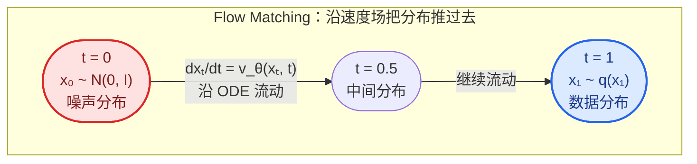
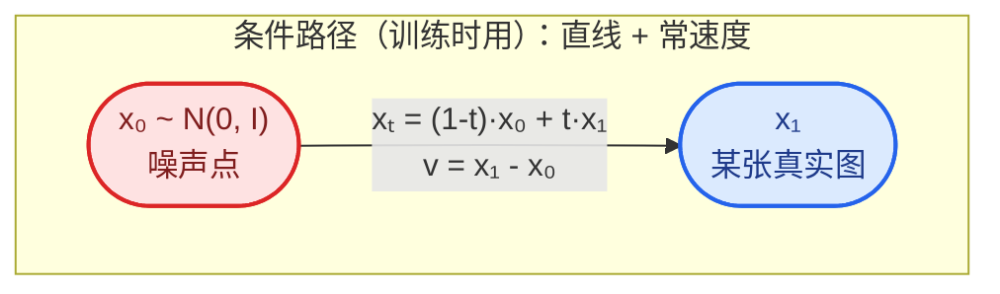

# Flow Matching

## 从概率流 ODE 出发

DDIM $\eta=0$ 的采样等价于解一条概率流 ODE，但那条 ODE 的速度场是"隐式"的——只有离散更新公式，没有显式的速度场。Flow Matching 回答的问题：**能不能直接把速度场学出来？** 答案：能，而且训练目标简单到和 DDPM 的 MSE 一个级别。

## 输运视角：生成 = 分布的"搬家"

- 源分布：纯噪声 $\mathcal{N}(0,I)$
- 目标分布：数据分布 $q$
- 速度场 $v(x_t,t)$ 定义一条 ODE：

$$
\frac{dx_t}{dt}=v(x_t,t),\qquad t\in[0,1]
$$

- 空间中每个点像一个小水滴，$v$ 是水流的方向和流速；噪声分布这片"云"沿水流漂 1 秒，漂完正好变成数据分布（pushforward）
- 生成 = 从噪声采一个点，沿 ODE 走 1 秒，落点就是一张图



## 核心难题

给定起止两个分布，能完成输运的速度场有**无穷多个**——不知道粒子该走哪条路。传统连续归一化流（CNF）用最大似然训练，每次算似然都要解 ODE，太贵。

## 关键技巧：条件流匹配（Conditional Flow Matching）

和 DDPM 的"一步到位公式"异曲同工：**先别管边缘分布，给每个具体数据点配一条简单的路**。

- 对每个真实数据 $x_1$，从一个噪声 $x_0$ 出发，走**直线插值路径**：

$$
x_t=(1-t)\,x_0+t\,x_1
$$

- 这条直线的速度场是**常数**：$v=x_1-x_0$（终点减起点）

**关键定理**：把所有条件速度场按数据分布求期望，得到的"平均速度场"恰好产生正确的边缘分布演化——网络学的是"一堆直线的平均方向"，而这个平均方向正好把噪声分布正确推成数据分布。



## 训练目标与伪代码

$$
L=\mathbb{E}_{t\sim U(0,1),\,x_1\sim q,\,x_0\sim\mathcal{N}(0,I)}\left[\left\|v_\theta(x_t,t)-(x_1-x_0)\right\|^2\right]
$$

**训练**
```
repeat
    x_1 ~ q(x_1)                        # 从数据集采样一张真实图
    x_0 ~ N(0, I)                       # 采样一个噪声点
    t   ~ Uniform(0, 1)                 # 随机取一个时刻
    x_t = (1-t)·x_0 + t·x_1             # 直线插值构造中间状态
    梯度下降: L = ‖v_θ(x_t, t) - (x_1 - x_0)‖²   # 回归速度（终点减起点）
until 收敛
```

和 DDPM 对比：除了回归目标从"噪声 $\epsilon$"换成"速度 $x_1-x_0$"，流程一模一样。

**采样（生成）**
```
x_0 ~ N(0, I)                           # 从噪声出发
for t = 0, Δt, 2Δt, ..., 1:             # 欧拉积分
    x_{t+Δt} = x_t + v_θ(x_t, t)·Δt
return x_1                              # 走到 t=1，得到生成图像
```

## 与 DDPM 的关系：三位一体

噪声 $\epsilon_\theta$、得分 $\nabla_{x_t}\log p_t$、速度 $v_\theta$ 三者只差一个系数——同一个东西的三种参数化。真正的差别在路径形状：

| | DDPM | Flow Matching |
|---|---|---|
| 路径 | 弯曲（$\sqrt{\bar{\alpha}_t}$ 几何衰减） | **直线** |
| 训练目标 | 噪声 MSE | 速度 MSE（同样简单） |
| 采样 | SDE 或 ODE（DDIM） | ODE，直线 → 大步长误差小，天然适合少步采样 |
| 源分布 | 高斯 | 任意 |

- 路径越直，欧拉大步长越准 → FM 十几步甚至几步就能出不错的图
- 训练极简：纯回归，不需要 ELBO 推导，不需要解 ODE
- 框架通用：换一条路径定义，就得到一个新的 FM 变体

## Rectified Flow 与 Stable Diffusion 3

随机配对 $x_0$ 和 $x_1$ 会让直线路径**交叉**，平均速度场变曲折，采样仍需小步：

- **Rectified Flow**：用模型自己生成的配对反复重训，迭代"拉直"路径
- **OT-CFM**：用最优传输给噪声和数据配对，让路径一开始就最直
- 落地成果：**Stable Diffusion 3 用的就是 rectified flow**

## ⚠️ 记号约定（与 DDPM 相反）

FM 文献里 $x_0$ = 噪声（源），$x_1$ = 数据（目标），$t$ 从 0 走到 1——和 DDPM（$x_0$=数据、$x_T$=噪声）正好相反，读论文时注意区分。
